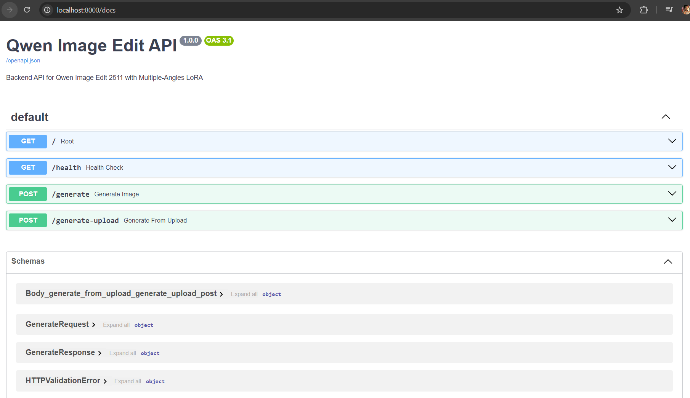
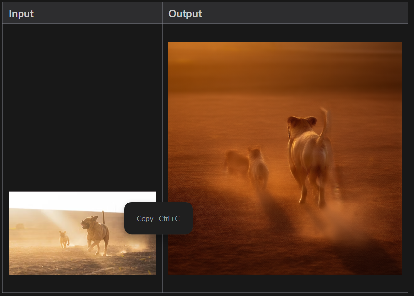

# Qwen Image Edit Backend

FastAPI backend for Qwen Image Edit 2511 with Multiple-Angles LoRA adapter.




## Requirements

- Python 3.10+
- CUDA-capable GPU (RTX 4070 Laptop with 8GB VRAM)
- ~20GB disk space for models

## Quick Start

### 1. Create Virtual Environment

```bash
cd qwen-image-edit-backend
python -m venv venv
venv\Scripts\activate  # Windows
# source venv/bin/activate  # Linux/Mac
```

### 2. Install Dependencies

```bash
pip install -r requirements.txt
```

### 3. Configure Environment

```bash
copy .env.example .env
# Edit .env if needed
```

### 4. Run Server

```bash
uvicorn app.main:app --host 0.0.0.0 --port 8000 --reload
```

Or:
```bash
python -m app.main
```

### 5. Access API

- Swagger UI: http://localhost:8000/docs
- Health Check: http://localhost:8000/health

## API Endpoints

### `POST /generate`

Generate an edited image from base64 reference.

**Request Body:**
```json
{
  "prompt": "<sks> right side view high angle shot close-up shot, studio lighting, realistic perspective, same subject, consistent identity",
  "reference_image": "data:image/png;base64,...",
  "seed": 12345,
  "guidance_scale": 1.0,
  "num_inference_steps": 4,
  "height": 768,
  "width": 768,
  "output_format": "base64"
}
```

**Response:**
```json
{
  "success": true,
  "image": "data:image/png;base64,...",
  "seed": 12345
}
```

### `POST /generate-upload`

Generate from file upload (multipart form).

**Form Fields:**
- `prompt` (string): Finalized prompt
- `reference_image` (file): Image file
- `seed` (int, optional): Random seed
- `guidance_scale` (float): Default 1.0
- `num_inference_steps` (int): Default 4
- `height` (int): Default 768
- `width` (int): Default 768

**Response:** PNG image bytes

### `GET /health`

Health check with GPU status.

```json
{
  "status": "ok",
  "model_loaded": true,
  "gpu_available": true,
  "gpu_name": "NVIDIA GeForce RTX 4070 Laptop GPU",
  "vram_free_gb": 5.2
}
```

## Memory Optimizations

Enabled for 8GB VRAM:
- FP16 inference
- Attention slicing
- VAE slicing
- Max resolution: 768×768

## Project Structure

```
qwen-image-edit-backend/
├── app/
│   ├── __init__.py
│   ├── main.py         # FastAPI endpoints
│   ├── schemas.py      # Pydantic models
│   ├── inference.py    # Model pipeline
│   └── utils.py        # Helpers
├── models/             # HF cache (created on first run)
├── requirements.txt
├── .env.example
└── README.md
```

## Frontend Integration

Example fetch from frontend:

```javascript
const response = await fetch('http://localhost:8000/generate', {
  method: 'POST',
  headers: { 'Content-Type': 'application/json' },
  body: JSON.stringify({
    prompt: generatePrompt(),
    reference_image: state.uploadedImage,
    seed: state.randomizeSeed ? null : state.seed,
    guidance_scale: state.guidanceScale,
    num_inference_steps: state.inferenceSteps,
    height: state.height,
    width: state.width,
    output_format: 'base64'
  })
});

const data = await response.json();
if (data.success) {
  displayOutputImage(data.image);
}
```
